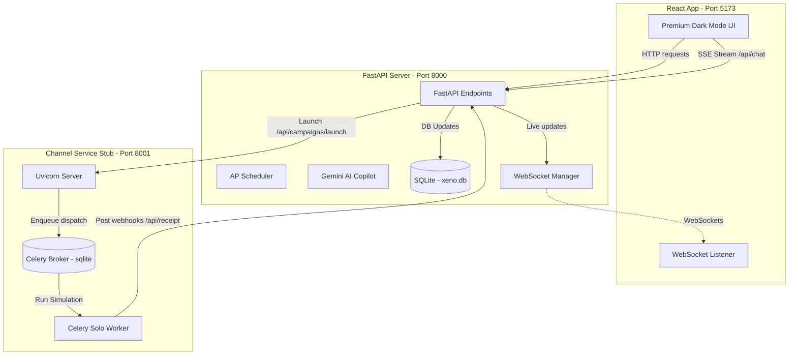

# Xeno CRM - Advanced AI-Native D2C Customer Relationship Management

Xeno CRM is an advanced, full-stack CRM built to ingest customer records, calculate behavioral RFM (Recency, Frequency, Monetary) segments, construct target audiences, and launch highly personalized messaging campaigns. 

The application features a premium dark-mode dashboard and **Xeno AI Copilot**, an intelligent chat assistant that uses live function-calling tool execution (via the Google Gemini SDK) to segment shoppers and manage campaigns in real-time.

---

## 🏗️ Technical Architecture



### Key Technical Decisions
1. **Decoupled Channel Service Stub & Webhooks**: Staging campaigns makes an asynchronous call to a separate messaging stub (Port 8001). This stub uses a Celery queue running a solo worker pool (optimized for Windows dev) to simulate progression updates (`Sent ➔ Delivered ➔ Read ➔ Opened ➔ Clicked ➔ Converted`).
2. **Idempotency & Funnel Progression Rules**: 
   - A dedicated `receipt_events` database table enforces a unique constraint on `(communication_id, event)` to block duplicate callback updates.
   - A linear weight scale (`STATUS_WEIGHTS`) blocks out-of-order callback progression (e.g., if "opened" arrives before "delivered", it is correctly updated and subsequent late "delivered" callbacks are safely ignored).
3. **Structured RFM Segmentation**: Real-time DB triggers calculate Recency, Frequency, and Monetary scores (1-5) and map users to 5 behaviors (VIP Dormants, Loyal High-Spenders, Lapsed Buyers, New Shoppers, Bargain Hunters) with overlap mathematical analysis.
4. **Xeno AI Copilot Chat-First UX**: Backed by Gemini's structured output model and tool declaration parameters. It contains 12 active tools (`create_segment`, `create_campaign`, `analyse_campaign`, etc.). If Gemini hits rate limits, it falls back to a regex-based parser.

---

## 🚀 Setup & Running Guide

### Prerequisites
* Python 3.10+
* Node.js 18+

### Step 1: Install Dependencies & Setup Environments

#### Backend & Channel Service Setup:
1. Navigate to the root directory and create/activate the virtual environment:
   ```powershell
   python -m venv .venv
   .venv\Scripts\activate
   ```
2. Install packages:
   ```powershell
   pip install -r backend/requirements.txt
   pip install -r channel_service/requirements.txt
   ```
3. Configure `backend/.env` file:
   ```env
   DATABASE_URL=sqlite:///./xeno.db
   CHANNEL_SERVICE_URL=http://localhost:8001
   PORT=8000
   GEMINI_API_KEY=YOUR_GEMINI_API_KEY
   ```

#### Frontend Setup:
1. Navigate to the `frontend` folder:
   ```bash
   cd frontend
   npm install
   ```

---

### Step 2: Spin Up the Services

You must run the following 4 services concurrently. In separate terminal tabs (with `.venv` activated where appropriate):

1. **FastAPI Backend Server** (Port 8000):
   ```bash
   uvicorn app.main:app --host 127.0.0.1 --port 8000
   ```
2. **Channel Service Stub** (Port 8001):
   ```bash
   cd channel_service
   uvicorn main:app --host 127.0.0.1 --port 8001
   ```
3. **Celery Simulation Worker**:
   ```bash
   cd channel_service
   celery -A tasks worker --loglevel=info -P solo
   ```
4. **Vite React Frontend Dev Server** (Port 5173):
   ```bash
   cd frontend
   npm run dev
   ```

---

## 📽️ Walkthrough Video Structure (5-6 Minutes)

A recommended script outline for your walkthrough:

### 1. Introduction (0:00 - 1:00)
* Open on the **Vite Web UI Dashboard** (Port 5173).
* Introduce the project: **Xeno Mini CRM**, a full-stack platform designed to help retail marketers segment their database and run data-driven, A/B-tested, personalized campaigns.
* Briefly showcase the **Premium Dark-Mode Theme** (neon glows, cards, Outfit/Plus Jakarta Sans typography).

### 2. Customers & Cohort Segment Analysis (1:00 - 2:00)
* Click on the **Customers** tab. Show how individual shopper details slide open in a drawer showing specific Recency, Frequency, and Monetary scores and interactive timelines.
* Move to the **Segments** tab. Show how selecting a segment displays its audience details and its **overlapping intersection percentage** with other segments in the database.
* Point out the **Analytics View** showing the 5x5 RFM heatmap.

### 3. Xeno AI Copilot Chat Demo (2:00 - 3:30)
* Go back to the **Dashboard** homepage. Talk about how the Xeno AI Copilot brings a chat-first UX.
* Type a message: *"Find customers who spent over ₹5000 and haven't ordered in 90 days"*.
* Show how the AI executes the `create_segment` tool under the hood, reports matching customer count, recommendations a channel (like RCS), and automatically drafts Option A and Option B campaign copies.
* Type *"Launch Option A"*. Walk through the instant feedback showing the campaign is now queued.

### 4. Celery Queue & Callback Loops (3:30 - 4:45)
* Switch to the **Campaigns** list. Show the campaign progress bar updating in real time.
* Explain the technical magic:
  * Backend calls **Channel Service Stub (Port 8001)** asynchronously.
  * **Celery task worker** simulates actual customer lifecycles.
  * Point out the status flow: `sent ➔ delivered ➔ read (WhatsApp blue tick at ~45%) ➔ opened ➔ clicked ➔ converted`.
  * Explain **idempotency & linear weight rules** which prevent database lock contention and callback out-of-order anomalies.

### 5. Codebase Walkthrough (4:45 - 6:00)
* Briefly open the codebase in VS Code (or your editor):
  * **`backend/app/receipt.py`**: Explain the `STATUS_WEIGHTS` sequence and the scale trade-off comments.
  * **`backend/app/agent.py`**: Explain the Gemini tool schemas mapping and tool execution.
  * **`channel_service/tasks.py`**: Show the step-by-step Celery simulation task.
* Close with a professional summary.

---

## 🌐 Deployment Guidelines

For submitting your live hosted URL:
1. **Frontend**: The Vite frontend compiles into static assets using `npm run build`. You can host it instantly on **Vercel**, **Netlify**, or **Firebase Hosting**.
2. **Backend & Workers**: Host the FastAPI server and Celery background worker on **Render**, **Railway**, or **Google Cloud Run**. You can configure a free Redis addon on Railway/Render to replace the local SQLite Celery broker.
